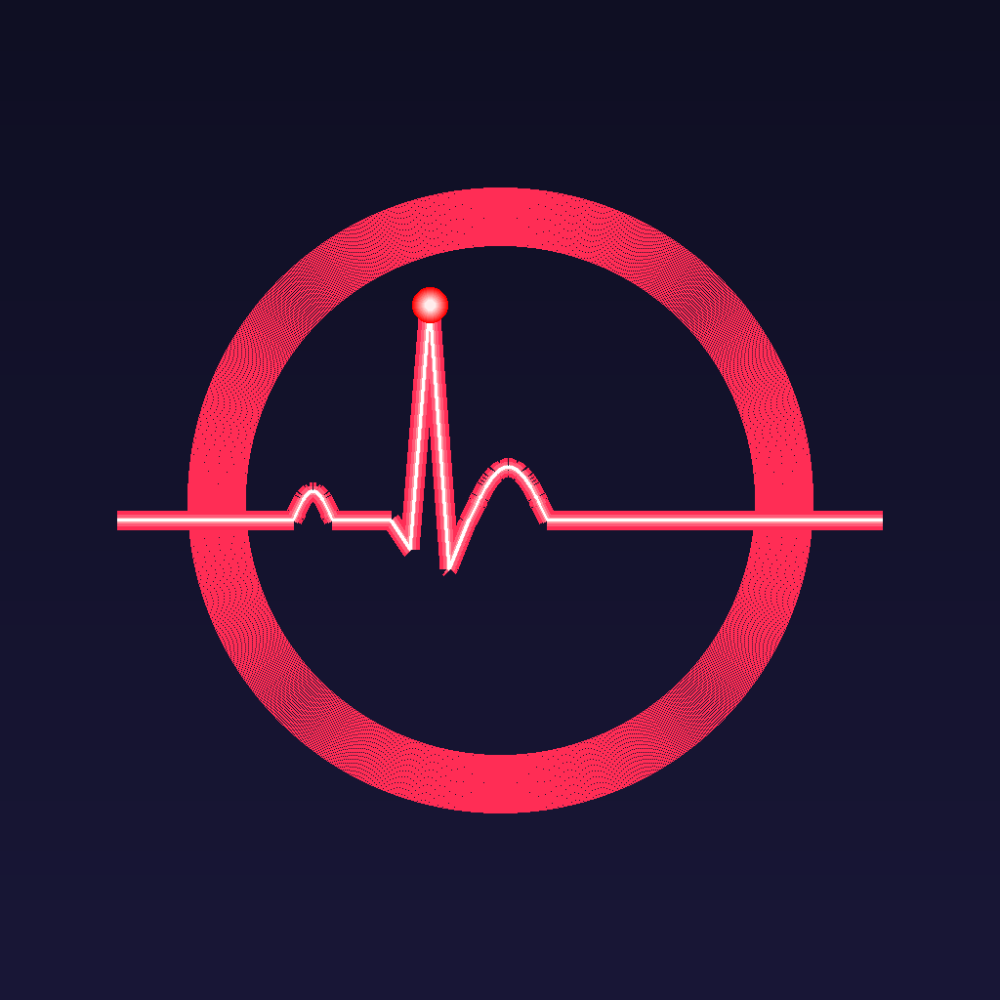

# health4.ai — Apple Health × AI

<p align="center">
  
</p>

<p align="center">
  <strong>Ask your AI about your sleep, HRV, recovery, and fitness — in plain language.</strong><br>
  Free iOS app · Your own database · Works with any MCP client
</p>

<p align="center">
  <a href="https://apps.apple.com/app/health4ai/id6783074944"><strong>Download health4ai on the App Store</strong></a>
</p>

<p align="center">
  <a href="https://health4.ai"></a>
  <a href="https://github.com/jefflitt1/health4ai/blob/main/LICENSE"></a>
  
  
  
  
</p>

---

## What it does

```
iPhone HealthKit → Your Supabase project → MCP server → Any AI
```

Apple Health holds years of your biometric data — sleep stages, HRV, heart rate, workouts, VO₂ max, and 150+ other metrics. health4.ai makes all of it queryable from Claude, ChatGPT, Cursor, Ollama, or any MCP-compatible client through purpose-built MCP tools.

**You control the data.** It syncs to a Supabase project you create and own. health4.ai runs no backend and never stores or has access to your health data.

---

## Why it exists

| Problem | health4.ai fix |
|---------|---------------|
| Apple has no HealthKit server API — all access requires an on-device app | Native iOS app with `HKObserverQuery` + `BGTaskScheduler` background sync |
| Health Auto Export only works on the same WiFi | Your data lands in Postgres — queryable from any AI, anywhere |
| The claude.ai Apple Health connector doesn't reach Claude Code CLI or Cursor | Standard MCP (stdio) — one config block works everywhere |
| Most solutions require a managed cloud service | Bring your own Supabase project — health4ai runs no server |

---

## Demo

> Demo video coming. Here's what a typical conversation looks like:

```
You:     How was my recovery this week? Anything standing out?

Claude:  Your recovery this week was mixed but trending positive.
         • HRV averaged 58ms (Tue–Thu strong at 64–68ms; Monday low at 44ms after Saturday's long run)
         • Sleep averaged 7h 12m — Wednesday and Thursday were your best nights (7h 40m+)
         • Resting HR dropped from 54bpm Monday to 49bpm Friday — a good sign
         Recommendation: today looks like a solid day for a moderate-intensity session.
```

---

## Quick start

health4ai needs a **Supabase project you own**. The app signs in with Supabase Auth and writes through a Supabase Edge Function, so plain Postgres (Neon, a local Docker container) is not a supported backend. Full walkthrough: [`docs/SETUP.md`](docs/SETUP.md).

**1. Create the schema.** Create a project at [supabase.com](https://supabase.com), open its SQL editor, and run [`web/public/schema.sql`](web/public/schema.sql) (also at https://health4.ai/schema.sql). It is generated from `supabase/bootstrap/`: tables, row-level security, and grants that deny clients direct access. Do **not** use `supabase db push` — the numbered migrations do not apply to a fresh project.

**2. Deploy the ingest function** (needs the [Supabase CLI](https://supabase.com/docs/guides/cli)):

```bash
git clone https://github.com/jefflitt1/health4ai.git
cd health4ai
supabase functions deploy healthkit-ingest --project-ref <your-project-ref> --no-verify-jwt
```

`--no-verify-jwt` is deliberate: the function verifies the signed-in user's token itself and writes only under that user's ID.

**3. Create your user.** In the dashboard, Authentication → Users → add a user, and copy its UID. The app signs in; it does not sign up.

**Then set up the MCP server** (from the same checkout):

```bash
cp mcp-server/.env.example mcp-server/.env
```

Edit `mcp-server/.env`:

```env
DATABASE_URL=postgresql://...  # your project's pooler connection string (database password, not a key)
HEALTHKIT_USER_ID=...           # your Supabase Auth user's UID (see mcp-server/.env.example)
```

**Add to your AI client:**

<details>
<summary><strong>Claude Code / Claude Desktop</strong></summary>

```json
{
  "mcpServers": {
    "health4ai": {
      "command": "python",
      "args": ["/path/to/health4ai/mcp-server/main.py"],
      "env": {
        "DATABASE_URL": "postgresql://...",
        "HEALTHKIT_USER_ID": "<your auth user UID>"
      }
    }
  }
}
```
</details>

<details>
<summary><strong>Cursor</strong></summary>

Same block → `~/.cursor/mcp.json`
</details>

<details>
<summary><strong>Ollama (local model)</strong></summary>

Pair with [`mcphost`](https://github.com/mark3labs/mcphost) or [`mcp-client-for-ollama`](https://github.com/jonigl/mcp-client-for-ollama):

```bash
mcphost --model ollama/llama3.2 \
  --mcp-server "health4ai:python /path/to/health4ai/mcp-server/main.py"
```

The model runs on your hardware and the MCP server runs locally; your health data is read from your own Supabase project.
</details>

**Install the iOS app** from the [App Store](https://apps.apple.com/app/health4ai/id6783074944), then connect it to that Supabase project (Project URL + anon key), sign in as the user you created, and tap **Start Sync**. For a TestFlight beta build, follow [the tester-isolation guide](docs/TESTFLIGHT-BETA.md); never use another person's backend or credentials.

---

## MCP tools

| Tool | What it answers |
|------|----------------|
| `get_health_summary` | Overview of key metrics for the past N days |
| `get_sleep` | Per-night sleep breakdown with REM, Deep, Core stages. One source per night: Oura > Apple Watch > Whoop > Garmin > Withings > whichever other source (iPhone included) has the most stage records |
| `get_hrv_trend` | Daily HRV (SDNN) with rolling comparison and trend |
| `get_daily_snapshot` | Everything recorded for a specific date |
| `get_workouts` | Recent workouts with type, duration, distance, calories |
| `query_metric` | Raw time-series for any HealthKit metric type |
| `get_long_term_trend` | Monthly aggregates over years (raw + summary tiers) |
| `get_coaching_brief` | Recovery status, sleep quality (same one-source-per-night rule as `get_sleep`), training load, fitness markers |
| `search_records` | Find days where a metric crossed a threshold |
| `get_metric_stats` | Personal baseline: min/max/mean/percentiles |
| `compare_periods` | Compare a metric between two date ranges |

### If a metric is empty, read `data_status` before believing it

**iOS never tells an app that a Health permission was denied.** A type you have not
shared returns an *empty result*, byte-for-byte identical to a day where you genuinely
did nothing. Nothing in HealthKit's API can distinguish the two, so an assistant reading
a bare `0` will confidently tell you that you took no steps.

Tools that can return an empty result therefore attach a `data_status` block:

- `never_recorded` — this metric has **never** produced a sample for you. For steps,
  heart rate, active energy or walking distance that is not possible if the data were
  being shared, so it almost certainly is not. Open **Health → Sharing → Apps →
  health4ai**, switch the metric on, then re-run the import from the app's Home tab.
- `empty_window` — nothing in the window you asked about, but the metric has data at
  other times. A real gap, not a permission problem.

This is not hypothetical. On the author's own account, step count, heart rate, active
energy and walking distance were silently unshared for nearly three months while every
other metric synced normally, and the app displayed a green "Complete" throughout.

---

## Architecture

```
┌─────────────────────────────────────────────────────────────┐
│  iPhone                                                      │
│  HKObserverQuery + BGTaskScheduler                          │
│  → continuous background sync                               │
└──────────────────────────┬──────────────────────────────────┘
                           │ HTTPS → your healthkit-ingest Edge Function
                           ▼
┌─────────────────────────────────────────────────────────────┐
│  Your Supabase project (you own it)                         │
│  healthkit_metrics · healthkit_daily_summaries              │
│  row-level security on · no direct client access            │
└──────────────────────────┬──────────────────────────────────┘
                           │ Postgres connection (database password, from your machine)
                           ▼
┌─────────────────────────────────────────────────────────────┐
│  FastMCP server  (mcp-server/main.py)                       │
│  FastMCP tools · stdio transport                             │
└──────────────────────────┬──────────────────────────────────┘
                           │ MCP
                           ▼
              Claude · ChatGPT · Cursor · Ollama · any client
```

**Data tiers:** queries within the last 30 days return raw samples. Older days use a pre-aggregated row from `healthkit_daily_summaries` where one exists and are otherwise aggregated per day inside Postgres from the raw samples, so results are complete whether or not the summariser has ever run on your project (on a fresh self-hosted project it never has). Responses carry a `tier` block saying how many days each tier served. Calendar days follow `HEALTH4AI_TZ` (default UTC; set it in `mcp-server/.env`).

---

## Repo structure

```
health4ai/
├── ios/                         # Swift/SwiftUI iOS app (iOS 17+)
│   └── Health4AI/               # HealthKit sync engine, auth, settings
├── mcp-server/
│   ├── main.py                  # FastMCP server entry point
│   ├── tools.py                 # MCP tool implementations
│   └── .env.example             # Required environment variables
├── web/
│   ├── public/schema.sql        # Generated from supabase/bootstrap (Supabase only)
│   └── src/                     # Astro marketing site
├── scripts/
│   ├── import_health_export.py  # One-time XML backfill from Apple Health export
│   └── summarize_historical.py  # Backfill daily summaries table
└── docs/
    └── SETUP.md                 # Detailed setup guide
```

---

## Privacy

Your health data goes **directly from your iPhone to your own Supabase project**. health4.ai never receives, stores, or has access to it. The MCP server runs locally with your own credentials — your data never touches our infrastructure.

See the [Privacy Policy](https://health4.ai/privacy) for full details.

---

## Contributing

MIT licensed. PRs welcome.

Good first areas: additional metric aggregations, multi-user support with JWT/RLS, Android, and more MCP client integration guides.

## License

MIT — see [LICENSE](LICENSE).
